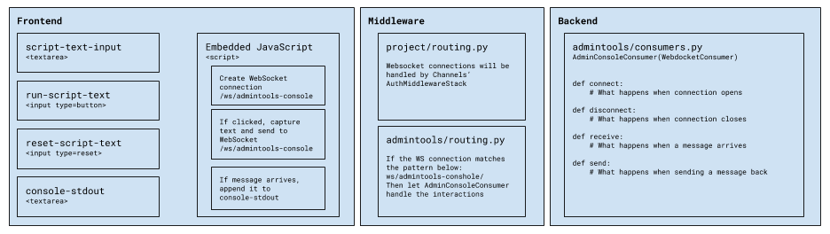
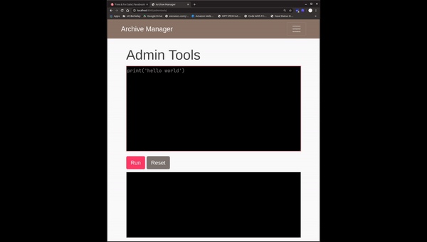

# PyArchive
In celebration of my anniversary at my first full-time job out of college, I would like to apply what I have learned from
my work, and demonstrate my understanding of software development through a web application.

## Highlights
#### AdminTools console prototype
On May 16, 2020 I finished implementing a prototype for the Admin Tools Console that works in similar way to 
Jupyter Notebook: there is a writable textbox and a read-only textbox, and the writable textbox accepts text that, 
if the "run" button is clicked, will trigger the code inside to be executed by a Python interpreter in the backend.

This implementation is my first exposure to the Websocket protocole as an upgrade from HTTP, and adapting the infamous 
"chat" tutorial to a prototype of my own feels pretty cool. Here is the design architecture:  
 

And here is a demo  
