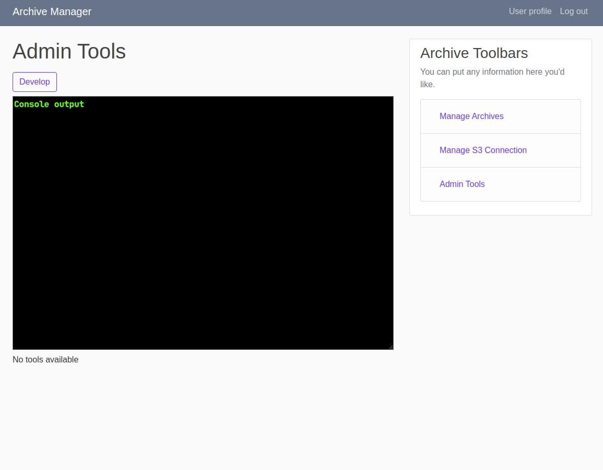
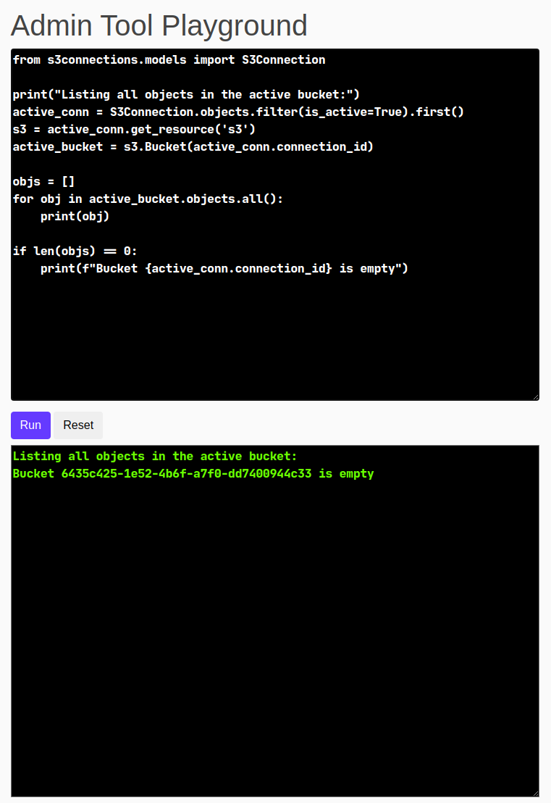
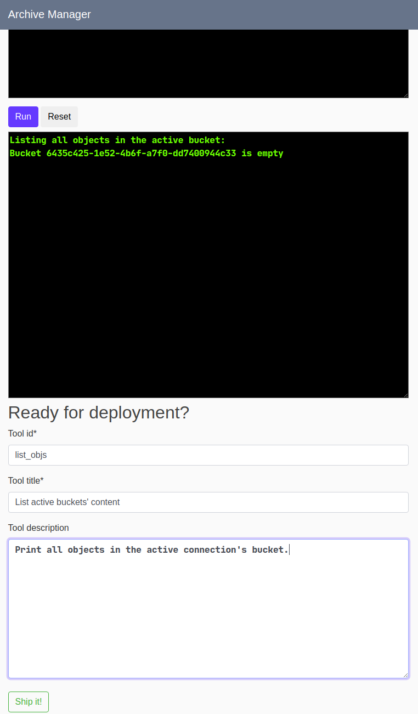

# PyArchive
In celebration of my anniversary at my first full-time job out of college, I would like to apply what I have learned from
my work, and demonstrate my understanding of software development through a web application.

## Highlights: Sprint 05.17.2020 - 05.23.2020
For this week's sprint I have fully implemented the prototype from last sprint into a workable feature. The new feature, which I will refer to as admin tools from now on, creates a workflow with which a system admin can develop, deploy, and destroy arbitrary system maintenance scripts written in Python.

The work flow begins by clicking on the `develop` button on the admin tools' home page:  

The `Develop` button will link to the `admintools-develop` view, where there are two text boxes with monospace font. The text box on the bottom is read-only, and serves as a display output; the text box on the top allows system admin to write Python script that performs certain task. Note that the implementation of this features allows the importing of modules from within the Django project as if running in `python manage.py shell`.  
 

The system admin can hit the `run` button as many times as he needs to develop this script. Once he/she feels confident, a form can be filled out, and the `ship it` button will save the script into a permenant state, which the sysadmin can then access and run from the home page with a single button click:  
  
  